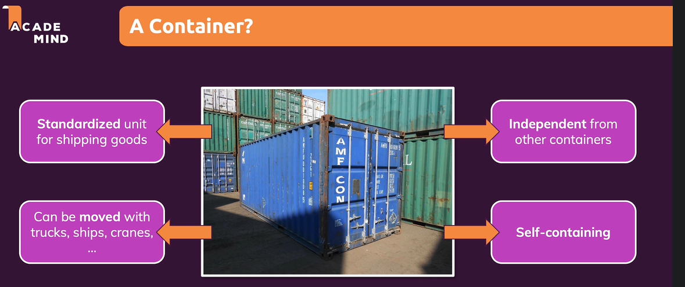
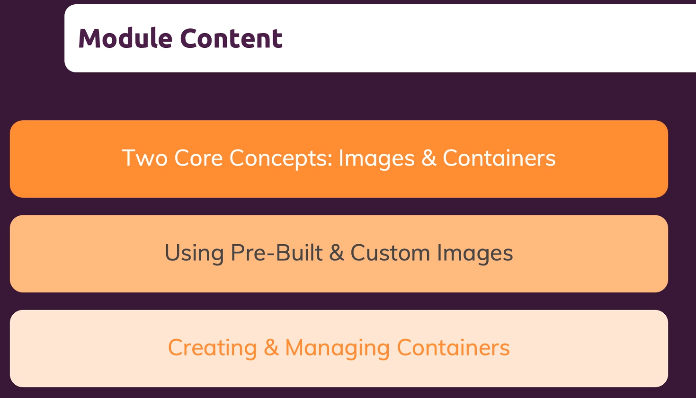
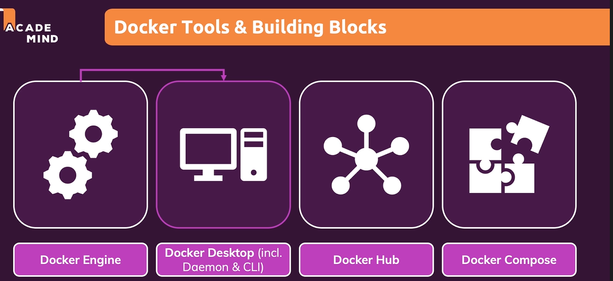
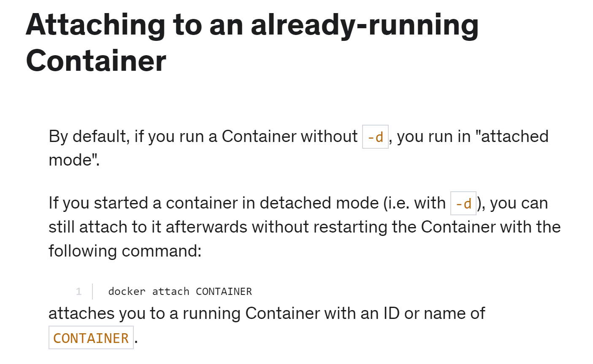

# MyDocker
Docker built up Project and Implementation

## 1.What is Docker ?
- A.Docker : 
    - Docker is a subset of project, is a software framework for building, running, and managing containers on servers and the cloud. 
 

- B.Core concept of Docker : Image & Containers : 
 

- C.Tool and building block : 
    - 

## 2.Install : The Error when I trying to install in Windows

- A.WSL 2 installation is incomplete
    - step1 : (就是你的Linux核心版本偏低了，該更新了。)
        - Install WSL: https://wslstorestorage.blob.core.windows.net/wslblob/wsl_update_x64.msi
    - step2 : 
        - Enable-WindowsOptionalFeature -Online -FeatureName Microsoft-Hyper-V -All 
        - 確認Linux的Windows子系统 和 Hyper-V 有被勾選(Windows功能 )

- B.Docker Desktop failed to start : 
    - a.確保下載版本為Docker 4.5 Up
    - b.將wsl2 設置為default version -> $wsl --set-default-version 2
    - c.Restart Your Computer
    and it work for me.

## 3.Concept : 
    - Image are read-only : If you wanna change something, you need to rebuilt the image( $docker build .)  
    - Layers Base : Every command in the Dockerfile represent a layer
        - 實際的使用案例如檔案B_Image_Layer 當中Dockerfile針對layer進行優化(將COPY package.json提到npm install 前, 後續再COPY所有,  因此當重新docker build . 中 npm 掃到json檔發現內容無更動時, 就會省略duplicate, 因此整個運算效率就會大幅加快)

## 4.Docker Desktop : 
    - 1.docker run -d -p 80:80 docker/getting-started
    [Tutorial Reference](https://www.youtube.com/watch?v=2ezNqqaSjq8)

## 5.Command that I used during the process:
    ### Make sure docker set up is complete : 
        - sudo docker run hello-world

    ### image :
        - Docker Build image : 
            - $docker build . #(!) rebuild image use the same command
        
        - Docker run image/ 
            - $docker run "image" (ex : docker run -p 3000:80 f09618ed686df3c73062a71b5e3ce1c0226f0f6f0c4a580354cda4f4df5a3701)
            - shortcut : and actually we can briefly use image like : (docker run -p 3000:80 f09 or docker run -p 3000:80 f) # -p mean "publish"
        
        - Docker image ID : 
            - $docker run -p 3000:2314 -d "IMAGE" (ex:docker run -p 3000:2314 -d 655)

    - Check current container ID/ current 主機映射到container的狀態 Image container : 
        - $docker ps or $docker container ls # Check all the running container
        - $docker ps -a  # Using all t  he container including the stop container

    - Start/Stop container :
        - START --> $docker start (docker) "NAMES" # Check "NAMES" by command $docker ps -a # (ex :  docker start great_easley )
        - STOP --> $docker stop "container name(ID)"(ex : docker stop 4b223e7cc8c5)
    - Remove Container : 
        - $docker remove "container name(ID)"(ex : docker rm 4b223e7cc8c5)

    - Remove not use container(移除所有未使用的 Docker 項目) : 
        - $docker system prune

    - Docker container's log : 
        -$docker log "container name "  (ex : docker logs epic_thompson)

    - Docker help : help you view lot of command.
        - $docker --help  

    - Attach Docker Container :
   
